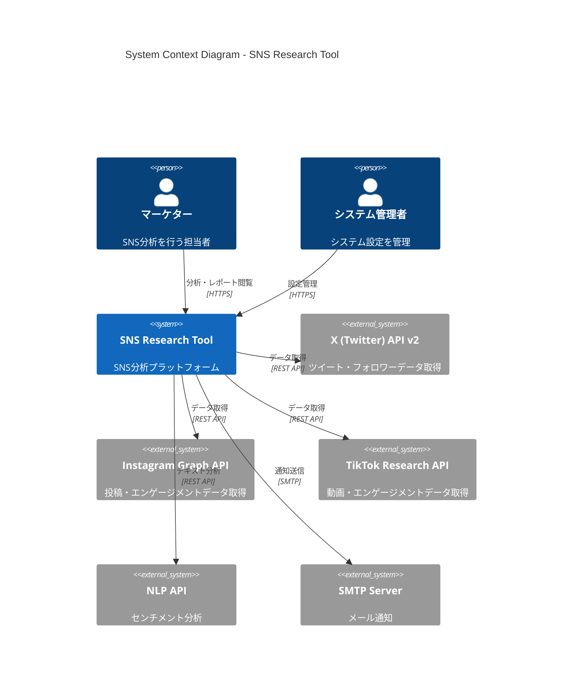
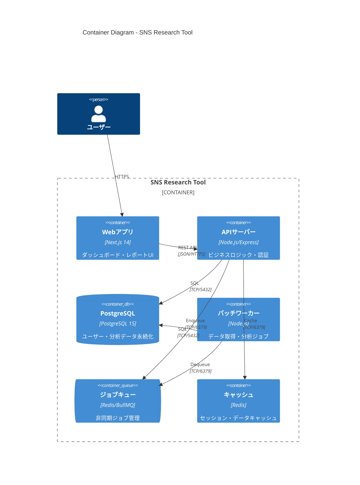
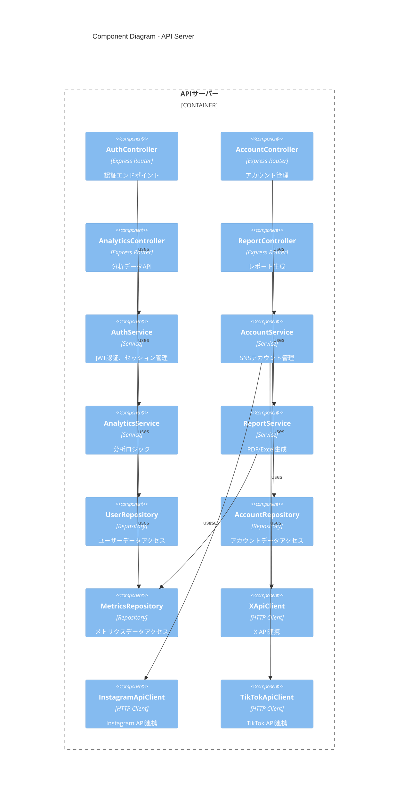
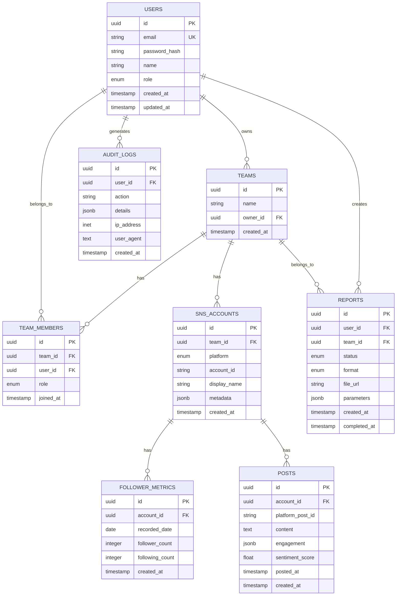

# Design: sns-research-tool

> C4モデルに基づく技術設計書。SNSリサーチ分析ツールの実装設計。

## 1. Context Diagram (Level 1)

### 1.1 システム概要
- **システム名**: SNS Research Tool
- **目的**: 複数SNSプラットフォームのアカウント分析・競合分析・キーワード分析を一元的に実行
- **主要ユーザー**: マーケティング担当者、SNS運用担当者

### 1.2 外部アクター・システム



| アクター/システム | 種別 | 役割 | 通信方式 |
|------------------|------|------|---------|
| マーケター | User | 分析実行、レポート閲覧 | HTTPS |
| システム管理者 | User | ユーザー管理、設定 | HTTPS |
| X API v2 | External | ツイート・フォロワーデータ | REST API (OAuth 2.0) |
| Instagram Graph API | External | 投稿・エンゲージメント | REST API (OAuth 2.0) |
| TikTok Research API | External | 動画データ | REST API (OAuth 2.0) |
| NLP API | External | センチメント分析 | REST API |
| SMTP Server | External | メール通知 | SMTP/TLS |

## 2. Container Diagram (Level 2)

### 2.1 コンテナ構成



### 2.2 コンテナ詳細

| コンテナ | 技術スタック | 責務 | スケーリング |
|---------|-------------|------|-------------|
| Web | Next.js 14, React 18, TailwindCSS | UI/UX、SSR、ダッシュボード | 水平（Vercel/ECS） |
| API | Node.js 20, Express, TypeScript | 認証、ビジネスロジック、API | 水平（ECS/Fargate） |
| DB | PostgreSQL 15 | データ永続化、トランザクション | 垂直 + Read Replica |
| Worker | Node.js 20, BullMQ | SNS API呼び出し、センチメント分析 | 水平（ECS/Fargate） |
| Queue | Redis 7 (Elasticache) | ジョブキュー、Pub/Sub | クラスター |
| Cache | Redis 7 (Elasticache) | セッション、APIレスポンスキャッシュ | クラスター |

## 3. Component Diagram (Level 3)

### 3.1 APIサーバー コンポーネント



### 3.2 コンポーネント責務

| コンポーネント | 責務 | 依存関係 |
|---------------|------|---------|
| AuthController | 認証リクエスト処理、JWT発行 | AuthService |
| AccountController | アカウント登録・削除・一覧 | AccountService |
| AnalyticsController | 分析データ取得、グラフデータ | AnalyticsService |
| ReportController | レポート生成リクエスト | ReportService |
| AuthService | 認証ロジック、トークン管理 | UserRepository |
| AccountService | SNSアカウント検証・管理 | AccountRepository, API Clients |
| AnalyticsService | エンゲージメント計算、トレンド分析 | MetricsRepository |
| ReportService | PDF/Excel生成、テンプレート処理 | MetricsRepository |
| XApiClient | X API v2通信、レート制限管理 | - |
| InstagramApiClient | Instagram Graph API通信 | - |
| TikTokApiClient | TikTok Research API通信 | - |

## 4. API Contracts

### 4.1 REST API

| Endpoint | Method | 説明 | Request | Response |
|----------|--------|------|---------|----------|
| `/api/v1/auth/login` | POST | ログイン | `{email, password}` | `{accessToken, refreshToken}` |
| `/api/v1/auth/refresh` | POST | トークン更新 | `{refreshToken}` | `{accessToken}` |
| `/api/v1/accounts` | GET | アカウント一覧 | `?page=1&limit=20` | `{data: [], meta: {}}` |
| `/api/v1/accounts` | POST | アカウント登録 | `{platform, accountId}` | `{data: {id, ...}}` |
| `/api/v1/accounts/:id` | DELETE | アカウント削除 | - | `{success: true}` |
| `/api/v1/analytics/followers/:accountId` | GET | フォロワー推移 | `?days=90` | `{data: [{date, count}]}` |
| `/api/v1/analytics/engagement/:accountId` | GET | エンゲージメント | `?days=30` | `{data: [{date, rate}]}` |
| `/api/v1/analytics/sentiment` | POST | センチメント分析 | `{keyword, days}` | `{positive, negative, neutral}` |
| `/api/v1/reports/generate` | POST | レポート生成 | `{accountIds, format}` | `{jobId}` |
| `/api/v1/reports/:jobId` | GET | レポート取得 | - | `{status, downloadUrl}` |

### 4.2 エラーレスポンス

```json
{
  "error": {
    "code": "ACCOUNT_NOT_FOUND",
    "message": "指定されたアカウントが見つかりません",
    "details": {
      "accountId": "@example"
    }
  }
}
```

| HTTPステータス | エラーコード | 説明 |
|---------------|-------------|------|
| 400 | VALIDATION_ERROR | リクエスト検証エラー |
| 401 | UNAUTHORIZED | 認証エラー |
| 403 | FORBIDDEN | 権限エラー |
| 404 | NOT_FOUND | リソース不在 |
| 429 | RATE_LIMITED | API制限到達 |
| 500 | INTERNAL_ERROR | サーバーエラー |

## 5. Data Model

### 5.1 ER Diagram



### 5.2 テーブル定義

| テーブル | カラム | 型 | 制約 | 説明 |
|---------|--------|------|------|------|
| users | id | UUID | PK | 主キー |
| users | email | VARCHAR(255) | UK, NOT NULL | メールアドレス |
| users | password_hash | VARCHAR(255) | NOT NULL | bcryptハッシュ |
| users | role | ENUM | NOT NULL | admin/manager/member |
| sns_accounts | platform | ENUM | NOT NULL | x/instagram/tiktok |
| sns_accounts | account_id | VARCHAR(100) | NOT NULL | @username or ID |
| follower_metrics | recorded_date | DATE | NOT NULL | 記録日（日次） |
| posts | sentiment_score | FLOAT | - | -1.0〜1.0 |

### 5.3 インデックス設計

```sql
-- 高頻度クエリ用インデックス
CREATE INDEX idx_follower_metrics_account_date ON follower_metrics(account_id, recorded_date DESC);
CREATE INDEX idx_posts_account_posted ON posts(account_id, posted_at DESC);
CREATE INDEX idx_posts_sentiment ON posts(account_id, sentiment_score);
CREATE INDEX idx_audit_logs_user_created ON audit_logs(user_id, created_at DESC);
```

## 6. 技術選定理由（ADR参照）

| 決定 | 選択 | 理由 | ADR |
|------|------|------|-----|
| 言語 | TypeScript | 型安全性、フロント/バック統一 | ADR-001 |
| フロントエンド | Next.js 14 | SSR、App Router、Vercel連携 | ADR-001 |
| バックエンド | Express + TypeScript | 軽量、エコシステム充実 | ADR-001 |
| DB | PostgreSQL 15 | JSONB、信頼性、AWS RDS対応 | ADR-003 |
| キャッシュ/キュー | Redis 7 | 高速、BullMQ対応 | ADR-003 |
| センチメント分析 | OpenAI API / AWS Comprehend | 日本語対応、精度 | ADR-002 |

## 7. セキュリティ設計

### 7.1 認証・認可

| 方式 | 技術 | 用途 |
|------|------|------|
| 認証 | JWT (RS256) + Refresh Token | ユーザー認証 |
| 認可 | RBAC (Role-Based Access Control) | 権限管理 |
| API認証 | API Key + HMAC | サーバー間通信（将来） |

### 7.2 トークン設計

```typescript
// Access Token (15分)
{
  sub: "user_id",
  email: "user@example.com",
  role: "manager",
  teamId: "team_id",
  iat: 1234567890,
  exp: 1234568790  // +15min
}

// Refresh Token (7日)
{
  sub: "user_id",
  type: "refresh",
  iat: 1234567890,
  exp: 1235172690  // +7days
}
```

### 7.3 データ保護

| データ種別 | 保護方式 | 備考 |
|-----------|---------|------|
| パスワード | bcrypt (cost=12) | ハッシュ化 |
| APIキー（SNS） | AES-256-GCM | DB暗号化 |
| PII | 必要最小限のみ保持 | メール、名前 |
| 通信 | TLS 1.3 | 全通信暗号化 |

## 8. インフラ設計

### 8.1 環境構成

| 環境 | 用途 | URL |
|------|------|-----|
| Development | 開発 | localhost:3000 |
| Staging | 検証 | stg.sns-research.example.com |
| Production | 本番 | app.sns-research.example.com |

### 8.2 AWS構成図

```
                    ┌─────────────────────────────────────────────────┐
                    │                    Internet                      │
                    └─────────────────────┬───────────────────────────┘
                                          │
                    ┌─────────────────────▼───────────────────────────┐
                    │              CloudFront (CDN)                    │
                    │         Static assets + API caching              │
                    └─────────────────────┬───────────────────────────┘
                                          │
                    ┌─────────────────────▼───────────────────────────┐
                    │           Application Load Balancer              │
                    │              (HTTPS termination)                 │
                    └──────────┬──────────────────────┬───────────────┘
                               │                      │
            ┌──────────────────▼────┐    ┌───────────▼────────────────┐
            │    ECS Fargate        │    │    ECS Fargate              │
            │    (Web + API)        │    │    (Worker)                 │
            │    Auto Scaling       │    │    Auto Scaling             │
            └──────────┬────────────┘    └───────────┬────────────────┘
                       │                              │
            ┌──────────▼──────────────────────────────▼────────────────┐
            │                     VPC Private Subnet                    │
            │  ┌─────────────┐  ┌─────────────┐  ┌─────────────┐       │
            │  │   RDS       │  │ ElastiCache │  │   Secrets   │       │
            │  │ PostgreSQL  │  │   Redis     │  │   Manager   │       │
            │  │ Multi-AZ    │  │   Cluster   │  │             │       │
            │  └─────────────┘  └─────────────┘  └─────────────┘       │
            └──────────────────────────────────────────────────────────┘
```

### 8.3 スケーリング設計

| コンポーネント | スケーリング方式 | トリガー |
|---------------|-----------------|---------|
| Web/API (ECS) | 水平 (2-10台) | CPU > 70%, Memory > 80% |
| Worker (ECS) | 水平 (1-5台) | Queue depth > 100 |
| RDS | 垂直 + Read Replica | 手動（負荷に応じて） |
| ElastiCache | クラスター | 手動 |

## 9. 関連ドキュメント

- [requirements.md](./requirements.md) - 要件定義
- [tasks.md](./tasks.md) - タスク分解
- [threat-model.md](./threat-model.md) - 脅威モデル
- [slo.md](./slo.md) - SLO/SLI定義
- [adr/](./adr/) - 技術決定記録
