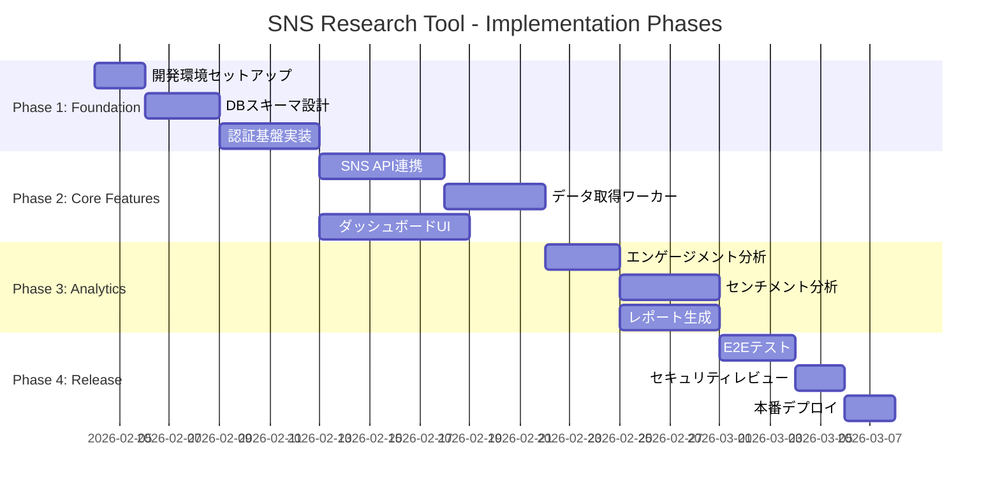
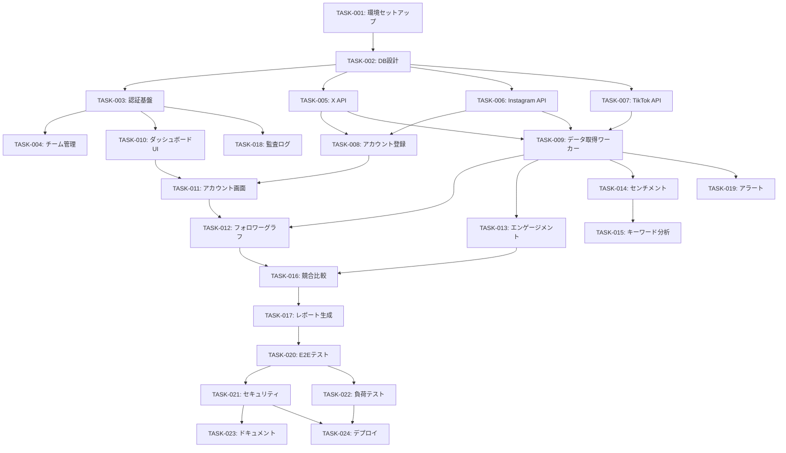

# Tasks: sns-research-tool

> Kiro形式のタスク分解。requirements.mdとdesign.mdに基づく実装タスク定義。

## 1. 概要

| 項目 | 値 |
|------|-----|
| 総タスク数 | 24 |
| フェーズ数 | 4 |
| 優先度 P1 | 16件 |
| 優先度 P2 | 6件 |
| 優先度 P3 | 2件 |

## 2. フェーズ構成



| Phase | 名称 | 目的 | 完了条件 |
|-------|------|------|---------|
| 1 | Foundation | 基盤構築 | 認証・DB稼働、開発環境完備 |
| 2 | Core Features | コア機能 | SNSデータ取得・表示動作 |
| 3 | Analytics | 分析機能 | 分析・レポート機能動作 |
| 4 | Release | リリース | 本番デプロイ完了 |

## 3. タスク一覧

### Phase 1: Foundation

#### TASK-001: 開発環境セットアップ
- **優先度**: P1 (MUST)
- **依存**: なし
- **担当**: -
- **関連要件**: REQ-901, REQ-902
- **完了条件**:
  - [ ] Docker Compose設定（PostgreSQL, Redis）
  - [ ] Next.js 14プロジェクト初期化
  - [ ] Express APIプロジェクト初期化
  - [ ] TypeScript設定
  - [ ] ESLint/Prettier設定
  - [ ] 環境変数テンプレート作成
- **実装メモ**:
  ```bash
  npx create-next-app@14 web --typescript --tailwind --app
  mkdir api && cd api && npm init -y
  docker-compose up -d
  ```

#### TASK-002: DBスキーマ設計・マイグレーション
- **優先度**: P1 (MUST)
- **依存**: TASK-001
- **担当**: -
- **関連要件**: REQ-001, REQ-002, REQ-903
- **完了条件**:
  - [ ] Prismaセットアップ
  - [ ] スキーマ定義（users, teams, sns_accounts, metrics, posts, reports, audit_logs）
  - [ ] マイグレーション実行
  - [ ] Seedデータ作成
  - [ ] インデックス作成
- **実装メモ**:
  - design.md Section 5 参照

#### TASK-003: 認証基盤実装
- **優先度**: P1 (MUST)
- **依存**: TASK-002
- **担当**: -
- **関連要件**: REQ-001, REQ-SEC-001
- **完了条件**:
  - [ ] ログインAPI（POST /api/v1/auth/login）
  - [ ] JWT発行（RS256、15分有効）
  - [ ] リフレッシュトークン（7日有効）
  - [ ] パスワードハッシュ（bcrypt cost=12）
  - [ ] アカウントロック（5回失敗で30分）
  - [ ] ユニットテスト
- **受入テスト**: AT-001, AT-002 (requirements.md参照)

#### TASK-004: チーム・ユーザー管理API
- **優先度**: P1 (MUST)
- **依存**: TASK-003
- **担当**: -
- **関連要件**: REQ-010
- **完了条件**:
  - [ ] チーム作成API
  - [ ] メンバー招待API
  - [ ] 招待メール送信
  - [ ] 招待リンク検証
  - [ ] RBAC実装（admin/manager/member）
- **受入テスト**: AT-016, AT-017 (requirements.md参照)

### Phase 2: Core Features

#### TASK-005: X (Twitter) API連携
- **優先度**: P1 (MUST)
- **依存**: TASK-002
- **担当**: -
- **関連要件**: REQ-002, REQ-003
- **完了条件**:
  - [ ] OAuth 2.0認証フロー
  - [ ] ユーザー情報取得（followers_count等）
  - [ ] ツイート取得（直近100件）
  - [ ] レート制限ハンドリング（50 req/15min）
  - [ ] リトライ・エクスポネンシャルバックオフ
  - [ ] APIキー暗号化保存
- **例外処理**: EH-003, EH-004 (requirements.md参照)

#### TASK-006: Instagram API連携
- **優先度**: P1 (MUST)
- **依存**: TASK-002
- **担当**: -
- **関連要件**: REQ-002, REQ-003
- **完了条件**:
  - [ ] Instagram Graph API接続
  - [ ] ビジネスアカウント情報取得
  - [ ] メディア（投稿）取得
  - [ ] インサイトデータ取得
  - [ ] レート制限ハンドリング（200 calls/hour）

#### TASK-007: TikTok API連携
- **優先度**: P2 (SHOULD)
- **依存**: TASK-002
- **担当**: -
- **関連要件**: REQ-002, REQ-003
- **完了条件**:
  - [ ] TikTok Research API接続
  - [ ] 動画データ取得
  - [ ] エンゲージメントデータ取得
  - [ ] レート制限ハンドリング（1,000 req/day）

#### TASK-008: アカウント登録API
- **優先度**: P1 (MUST)
- **依存**: TASK-005, TASK-006
- **担当**: -
- **関連要件**: REQ-002
- **完了条件**:
  - [ ] POST /api/v1/accounts
  - [ ] プラットフォーム別アカウント検証
  - [ ] 重複チェック
  - [ ] チーム紐付け
  - [ ] 登録上限チェック（50件/チーム）
- **受入テスト**: AT-003, AT-004 (requirements.md参照)

#### TASK-009: データ取得ワーカー実装
- **優先度**: P1 (MUST)
- **依存**: TASK-005, TASK-006, TASK-007
- **担当**: -
- **関連要件**: REQ-003, REQ-004
- **完了条件**:
  - [ ] BullMQジョブキュー設定
  - [ ] 日次バッチジョブ（毎日6:00 JST）
  - [ ] 手動更新ジョブ
  - [ ] 重複実行防止
  - [ ] 部分失敗時の継続処理
  - [ ] ジョブステータス管理
- **受入テスト**: AT-005, AT-006, AT-007 (requirements.md参照)

#### TASK-010: ダッシュボードUI基盤
- **優先度**: P1 (MUST)
- **依存**: TASK-003
- **担当**: -
- **関連要件**: REQ-005, REQ-901
- **完了条件**:
  - [ ] Next.js App Router設定
  - [ ] 認証ミドルウェア
  - [ ] レイアウトコンポーネント
  - [ ] サイドバー・ヘッダー
  - [ ] ローディング・エラー状態
  - [ ] レスポンシブ対応

#### TASK-011: アカウント一覧・詳細画面
- **優先度**: P1 (MUST)
- **依存**: TASK-008, TASK-010
- **担当**: -
- **関連要件**: REQ-002, REQ-005
- **完了条件**:
  - [ ] アカウント一覧表示
  - [ ] アカウント追加モーダル
  - [ ] アカウント詳細画面
  - [ ] 「今すぐ更新」ボタン
  - [ ] 削除確認ダイアログ

### Phase 3: Analytics

#### TASK-012: フォロワー推移グラフ
- **優先度**: P1 (MUST)
- **依存**: TASK-009, TASK-011
- **担当**: -
- **関連要件**: REQ-005
- **完了条件**:
  - [ ] 折れ線グラフコンポーネント（Chart.js/Recharts）
  - [ ] 期間フィルタ（7日/30日/90日/1年）
  - [ ] 日次増減表示
  - [ ] ツールチップ
  - [ ] データなし状態
- **受入テスト**: AT-008, AT-009 (requirements.md参照)

#### TASK-013: エンゲージメント率計算・表示
- **優先度**: P1 (MUST)
- **依存**: TASK-009
- **担当**: -
- **関連要件**: REQ-006
- **完了条件**:
  - [ ] エンゲージメント率計算ロジック
  - [ ] 投稿別エンゲージメント表示
  - [ ] 平均・トレンド表示
  - [ ] フォロワー0の場合のN/A表示
- **受入テスト**: AT-010 (requirements.md参照)

#### TASK-014: センチメント分析実装
- **優先度**: P2 (SHOULD)
- **依存**: TASK-009
- **担当**: -
- **関連要件**: REQ-009
- **完了条件**:
  - [ ] NLP APIクライアント実装
  - [ ] バッチ分析ジョブ
  - [ ] スコア保存（-1.0〜1.0）
  - [ ] Positive/Negative/Neutral分類
  - [ ] 日本語・英語対応
- **受入テスト**: AT-014, AT-015 (requirements.md参照)

#### TASK-015: キーワード分析機能
- **優先度**: P2 (SHOULD)
- **依存**: TASK-014
- **担当**: -
- **関連要件**: REQ-008
- **完了条件**:
  - [ ] キーワード検索API
  - [ ] 投稿数推移グラフ
  - [ ] センチメント分布円グラフ
  - [ ] 関連キーワードリスト
- **受入テスト**: AT-013 (requirements.md参照)

#### TASK-016: 競合比較機能
- **優先度**: P1 (MUST)
- **依存**: TASK-012, TASK-013
- **担当**: -
- **関連要件**: REQ-007
- **完了条件**:
  - [ ] 複数アカウント選択UI
  - [ ] 比較グラフ表示
  - [ ] テーブル形式比較

#### TASK-017: レポート生成機能
- **優先度**: P1 (MUST)
- **依存**: TASK-016
- **担当**: -
- **関連要件**: REQ-007
- **完了条件**:
  - [ ] PDFテンプレート作成
  - [ ] Excelテンプレート作成
  - [ ] 非同期生成ジョブ
  - [ ] ダウンロードリンク生成
  - [ ] メール通知（60秒超過時）
- **受入テスト**: AT-011, AT-012 (requirements.md参照)

### Phase 4: Release

#### TASK-018: 監査ログ実装
- **優先度**: P1 (MUST)
- **依存**: TASK-003
- **担当**: -
- **関連要件**: REQ-SEC-003
- **完了条件**:
  - [ ] ログイン/ログアウト記録
  - [ ] アカウント操作記録
  - [ ] レポート生成記録
  - [ ] IPアドレス・User-Agent記録
  - [ ] 90日保持・自動削除
- **受入テスト**: AT-024 (requirements.md参照)

#### TASK-019: エラーアラート設定
- **優先度**: P1 (MUST)
- **依存**: TASK-009
- **担当**: -
- **関連要件**: REQ-OPS-001
- **完了条件**:
  - [ ] CloudWatch Alarms設定
  - [ ] Slack通知設定
  - [ ] メールバックアップ通知
  - [ ] 5xxエラー率監視
- **受入テスト**: AT-025 (requirements.md参照)

#### TASK-020: E2Eテスト作成
- **優先度**: P1 (MUST)
- **依存**: TASK-017
- **担当**: -
- **関連要件**: 全REQ
- **完了条件**:
  - [ ] Playwright設定
  - [ ] ログインフローテスト
  - [ ] アカウント登録フローテスト
  - [ ] レポート生成フローテスト
  - [ ] CI/CD統合
  - [ ] カバレッジ80%以上

#### TASK-021: セキュリティレビュー
- **優先度**: P1 (MUST)
- **依存**: TASK-020
- **担当**: -
- **関連要件**: REQ-SEC-001, REQ-SEC-002, REQ-SEC-003
- **完了条件**:
  - [ ] OWASP Top 10チェック
  - [ ] 依存関係脆弱性スキャン（npm audit）
  - [ ] APIキー漏洩チェック
  - [ ] 認証・認可テスト
  - [ ] 指摘事項修正

#### TASK-022: 負荷テスト
- **優先度**: P2 (SHOULD)
- **依存**: TASK-020
- **担当**: -
- **関連要件**: REQ-904
- **完了条件**:
  - [ ] k6/Artillery設定
  - [ ] 50同時ユーザーテスト
  - [ ] レスポンス時間3秒以内確認
  - [ ] ボトルネック特定・改善

#### TASK-023: ドキュメント整備
- **優先度**: P3 (COULD)
- **依存**: TASK-021
- **担当**: -
- **完了条件**:
  - [ ] API仕様書（OpenAPI）
  - [ ] 環境構築手順書
  - [ ] 運用手順書更新

#### TASK-024: 本番デプロイ
- **優先度**: P1 (MUST)
- **依存**: TASK-021, TASK-022
- **担当**: -
- **関連要件**: REQ-902
- **完了条件**:
  - [ ] Terraformインフラ構築
  - [ ] Stagingデプロイ・検証
  - [ ] 本番デプロイ
  - [ ] ヘルスチェック確認
  - [ ] モニタリングダッシュボード確認
  - [ ] ロールバック手順確認

## 4. 依存関係図



## 5. リスク・ブロッカー

| ID | リスク | 影響 | 緩和策 | 関連タスク |
|----|--------|------|--------|-----------|
| R-001 | X API仕様変更 | 高 | APIバージョン固定、モック作成 | TASK-005 |
| R-002 | TikTok API承認遅延 | 中 | Phase 2で除外可能に設計 | TASK-007 |
| R-003 | センチメント分析精度 | 中 | 複数モデル評価、しきい値調整 | TASK-014 |
| R-004 | レート制限超過 | 高 | キュー制御、バックオフ実装 | TASK-009 |

## 6. 進捗トラッキング

| タスク | ステータス | 開始日 | 完了日 | 担当 |
|--------|-----------|--------|--------|------|
| TASK-001 | TODO | - | - | - |
| TASK-002 | TODO | - | - | - |
| TASK-003 | TODO | - | - | - |
| TASK-004 | TODO | - | - | - |
| TASK-005 | TODO | - | - | - |
| TASK-006 | TODO | - | - | - |
| TASK-007 | TODO | - | - | - |
| TASK-008 | TODO | - | - | - |
| TASK-009 | TODO | - | - | - |
| TASK-010 | TODO | - | - | - |
| TASK-011 | TODO | - | - | - |
| TASK-012 | TODO | - | - | - |
| TASK-013 | TODO | - | - | - |
| TASK-014 | TODO | - | - | - |
| TASK-015 | TODO | - | - | - |
| TASK-016 | TODO | - | - | - |
| TASK-017 | TODO | - | - | - |
| TASK-018 | TODO | - | - | - |
| TASK-019 | TODO | - | - | - |
| TASK-020 | TODO | - | - | - |
| TASK-021 | TODO | - | - | - |
| TASK-022 | TODO | - | - | - |
| TASK-023 | TODO | - | - | - |
| TASK-024 | TODO | - | - | - |

## 7. 関連ドキュメント

- [requirements.md](./requirements.md) - 要件定義
- [design.md](./design.md) - 技術設計
- [threat-model.md](./threat-model.md) - 脅威モデル
- [slo.md](./slo.md) - SLO/SLI定義
